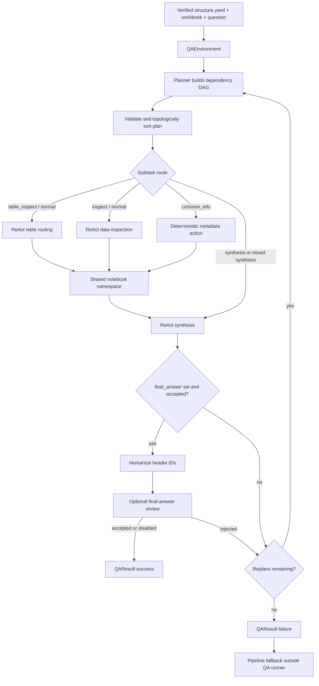

# QA Pipeline

This document describes the current question-answering implementation under
`TableAgent/QA/`. The QA phase consumes a workbook plus a persisted, verified
`structure.yaml`; it does not discover table layout itself.

The main orchestrator is [`TableQARunner`](runner.py). In benchmark runs it is called
by [`TableAgentPipeline._run_verified_qa()`](../pipeline/table_agent_pipeline.py), which
also owns the fallback path used when notebook QA cannot produce an accepted answer.

## Inputs and output

The runner receives:

- a user question;
- the path to a workbook;
- the path to its verified `structure.yaml`;
- an answer LLM client for planning and review/localization steps;
- an optional custom code-generation action in place of the default LLM-backed one;
- optional related structures, a table retriever, and QA configuration.

It returns a [`QAResult`](../schema/qa.py) containing the final plan, all subtask
outputs, the final answer, success/error state, token usage, replan count, logs, and
artifact paths.

The workbook is opened with `openpyxl` using `data_only=True`. Therefore normal cell
reads see cached formula results stored in the workbook. Formula-relation operators
can perform supported recalculations in memory without modifying the source workbook.

## Flow at a glance



## 1. Runtime initialization

[`QAEnvironment`](../environment/qa_env.py) creates the shared runtime used by every
subtask in one runner instance:

- parsed table/header structures and formula relations from `structure.yaml`;
- optional sibling/related structures for multi-sheet common-information answers;
- the openpyxl workbook;
- the unified [`TableOperators`](operators/table_operator.py) facade;
- an [`ExperiencePool`](../schema/experience.py) containing recent attempts;
- a structured [`QALogger`](../environment/logger.py);
- a persistent notebook namespace managed by [`Notebook`](../environment/notebook.py).

The initial notebook namespace exposes:

```text
pd, np (when installed), openpyxl, env, operators,
Cell, CellRange, AxisSelection, Header, namespace (read-only compatibility view)
```

`locals()` and `globals()` return the same read-only workspace view for compatibility
with generated code. Direct variable access remains the preferred form.

When a table is selected, the runner also preloads:

```text
selected_table_ids   Ordered list of active table IDs
table_ids            Alias for selected_table_ids
table_dfs            Mapping of table ID to logical DataFrame
table_id             Primary table ID
table_df             Primary logical DataFrame
<safe_table_id>      One variable per selected table
```

Each DataFrame is produced by
`operators.read_table_as_dataframe(table_id, has_headers=True)`. It uses verified
header IDs as column names, expands real merged data cells in memory, and collapses
multiple physical columns when one verified logical header spans them.

## 2. Planning

[`TableQAPlanner`](agents/planner.py) delegates plan generation to
[`WriteQAPlanAction`](actions/write_plan.py). The planner receives:

- the question;
- workbook sheet names;
- the table catalog;
- verified table/header descriptions and formula relations;
- related prepared-sheet structures, when supplied;
- the previous plan and runtime failure evidence during replanning.

The LLM must return a JSON dependency graph. Every subtask has this shape:

```json
{
  "id": "inspect_target_values",
  "description": "Filter the relevant records and retain the requested fields.",
  "layer": "inspect",
  "category": "normal",
  "depends_on": ["select_relevant_tables"],
  "metadata": {}
}
```

### Layers

| Layer           | Purpose                                                       | Required result                      |
| --------------- | ------------------------------------------------------------- | ------------------------------------ |
| `table_inspect` | Select relevant tables from a multi-table catalog.            | Set `selected_table_ids`.            |
| `inspect`       | Read, filter, join, aggregate, or otherwise prepare evidence. | Produce stdout or namespace updates. |
| `synthesis`     | Compute and format the user-facing answer.                    | Set `final_answer`.                  |

### Categories

| Category      | Route                                                               |
| ------------- | ------------------------------------------------------------------- |
| `normal`      | LLM-generated Python, notebook execution, and review.               |
| `common_info` | Deterministic extraction from verified workbook/structure metadata. |

Non-synthesis `common_info` subtasks must specify
`metadata.common_info_scope` as `workbook`, `sheet`, or `table`. Optional
`metadata.target_names` identifies explicit sheets or tables.

The plan parser validates IDs, descriptions, layers, categories, and common-info
metadata. Invalid JSON receives one formatter/repair request. An optional category
review can correct structural-versus-data routing. For a normal question with multiple
available tables, the action inserts or wires a `table_inspect` task when the generated
plan omitted one.

Before execution, the runner topologically sorts the plan and rejects duplicate IDs,
unknown dependencies, and dependency cycles.

## 3. Subtask routing

[`TableQARunner._execute_plan()`](runner.py) executes the sorted DAG sequentially. A
subtask starts only after all of its declared dependencies have succeeded.

Routing is performed in this order:

1. A synthesis task depending on both `normal` and `common_info` branches uses the
   normal synthesis agent so it can combine both kinds of evidence.
2. Other `common_info` tasks use `CommonInfoSubtaskAction`.
3. Other `synthesis` tasks use `TableQASynthesisAgent`.
4. Remaining `table_inspect` and `inspect` tasks use `TableQAAgent`.

The first failed subtask stops the current plan attempt. Successfully completed
subtasks remain in the notebook history and may be included as evidence for replanning
or pipeline fallback.

## 4. Normal ReAct execution

[`TableQAAgent`](agents/react_agent.py) handles normal table selection and inspection.
[`TableQASynthesisAgent`](agents/synthesis_agent.py) uses the same loop but additionally
requires `final_answer`.

For each attempt, up to `qa_max_retries` total attempts:

1. **Generate:** [`LLMCodeGenerationAction`](actions/llm_code_generation.py) asks the
   LLM for JSON containing `reasoning`, executable `code`, and `description`.
2. **Repair format:** malformed code-generation JSON can receive bounded formatting
   repair calls before the attempt is treated as a generation failure.
3. **Execute:** [`ExecuteNotebookCodeAction`](actions/execute_notebook.py) runs the code
   in the persistent notebook namespace.
4. **Observe:** stdout, stderr, traceback, and namespace updates are captured and
   compacted for prompts and logs. Full cell outputs remain in notebook history, while
   computed values remain in the shared namespace.
5. **Review:** [`ReviewSubtaskAction`](actions/review.py) applies local requirements,
   then asks the reviewer LLM when one is configured.
6. **Record:** the attempt and review score are added to the experience pool.
7. **Retry:** a rejected or failed attempt is regenerated using the failed code,
   runtime observation, notebook history, and recent experience.

Local review rejects an attempt when:

- execution failed;
- synthesis did not set `final_answer`;
- the final answer does not use the language required by the question;
- table inspection did not set a non-empty `selected_table_ids` value;
- normal inspection produced neither output nor namespace updates.

Before synthesis, the runner records namespace updates accepted from every transitive
dependency. Compact previews of these variables are included in the synthesis prompt as
accepted inspection evidence. They are advisory rather than protected: synthesis may
reuse, transform, rename, or recompute values, and local review does not require any
exact dependency variable name.

The code-generation and reviewer prompts reduce filter drift semantically. They direct
the agent to preserve the verified table/sheet, target identity, date, equipment,
status, and other question conditions; resolve columns through verified IDs or labels
instead of unverified fixed positions; and validate re-filtered data with row counts or
identifying keys. This avoids false rejections caused by variable-name heuristics while
still giving the reviewer evidence for detecting a genuinely changed scope.

### Generated-code boundary

Notebook code runs with restricted imports and selected safe builtins. The allowed
import roots include standard calculation modules, pandas/numpy, openpyxl, and
`TableAgent`. Code executes in-process and shares state with later cells.

The namespace is persistent and is not transactionally rolled back after an exception
or review rejection. A failed inspection cell can therefore leave variables behind.
Prompts and reviewers use accepted dependency previews, notebook history, explicit
outputs, matched-row counts, and identifying keys to distinguish accepted evidence from
abandoned attempts. The notebook does not apply assignment protection to ordinary
workspace variables.

## 5. Data access through operators

Generated code normally accesses workbook data through the `operators` facade. Its
catalog is included in code-generation system prompts.

The main operator families are:

- **Structure:** list tables and find verified headers.
- **Workbook:** read A1 ranges, logical tables, raw worksheet bounds, or DataFrames.
- **Range:** union, intersection, difference, crossing, and sparse projections.
- **Filter:** select matching row or column positions and read projected values.
- **Multi-table:** retrieve tables, join, union, group, inspect relations, and evaluate
  stored formula relations.
- **Calculation:** use ordinary Python, pandas, and numpy in the notebook.

The logical table DataFrame is a convenience view over a verified portion of the
original workbook. It does not represent the entire worksheet unless the structure's
header/data ranges cover the entire worksheet.

## 6. Common-information route

[`CommonInfoSubtaskAction`](actions/common_info.py) is used for questions describing a
workbook, sheet, or table itself rather than business records inside it.

Inspection is deterministic:

- select records using the planner-provided scope and optional target names;
- read verified table names, descriptions, sheet ownership, and top-level headers;
- combine related structures when workbook-wide information spans prepared sheets;
- exclude configured sheet names;
- store rendered text and structured records in `common_info_outputs` and
  `common_info_records`.

Pure common-info synthesis deduplicates dependency records, removes redundant table
blocks already covered by a sheet block, renders Markdown, localizes the prose into the
question's required language, and writes `final_answer`.

The localization LLM is constrained to translate the deterministic result; it is not
used to invent structural facts. A mixed question uses deterministic common-info
inspection but normal synthesis to combine it with calculated or record-level data.

## 7. Final answer and replanning

After every subtask succeeds, the runner reads `final_answer` from the shared namespace.
For normal answers it replaces unambiguous internal header IDs with their verified
user-facing labels. Pure common-info answers are already rendered with labels and are
not rewritten.

When `qa_final_answer_review` is enabled, an independent LLM reviews the answer against
the successful code and observations from the current plan attempt. A clear rejection
turns the run into a replanning attempt. Reviewer failures or malformed reviewer output
are treated as review unavailable and do not reject the answer.

Planning failures, dependency errors, subtask failures, a missing `final_answer`, and
final-review rejection share the `qa_max_replans` budget. Replanning receives:

- the previous complete plan;
- the current failure message;
- compact observations from the most recent subtask outputs.

Before each plan attempt, only `final_answer` is removed. The notebook, experience pool,
and other variables remain available. If the replan budget is exhausted, the runner
returns the last plan and failure state.

## 8. Pipeline-level fallback

Fallback is implemented outside `TableAgent/QA/` in
[`TableAgentPipeline._run_verified_qa()`](../pipeline/table_agent_pipeline.py).

If `TableQARunner` fails:

1. The pipeline first collects successful `normal` inspection observations from the
   failed run and asks the answer agent to answer using only that verified evidence.
2. If no such observations exist, it uses the configured source-context prompt, with
   an image path when the answer client supports image generation.

The returned pipeline metadata records `fallback_used`, `fallback_source`, QA token
usage, error information, replan count, answer route, and QA artifact paths.

## 9. Artifacts and logging

Every runner call creates a timestamped question directory under `qa_artifact_dir` or,
by default, `logs/qa_runs/`:

```text
<run_id>/
|-- events.jsonl
|-- plan.json
|-- result.json
|-- notebook.ipynb
|-- answer.py                 # final synthesis cell when available
|-- cells/                    # every executed notebook cell
`-- generated_code/          # final code recorded for every subtask output
```

`qa_log_path` optionally appends all structured events to a separate JSONL file while
the runner is active. Event logging includes prompts and model responses, execution
previews, reviews, replans, final status, and artifact locations.

## 10. Configuration

| Setting                     |        Default | Meaning                                                          |
| --------------------------- | -------------: | ---------------------------------------------------------------- |
| `qa_max_retries`            |            `3` | Total code-generation/execution attempts per normal subtask.     |
| `qa_max_replans`            |            `5` | Shared budget for planning retries and complete-plan replans.    |
| `qa_max_experience_records` |            `5` | Recent attempts retained for regeneration context.               |
| `qa_max_observation_chars`  |         `2000` | Compact stdout/stderr preview size.                              |
| `qa_max_error_chars`        |         `2000` | Compact traceback preview size.                                  |
| `qa_max_value_repr_chars`   |          `800` | Maximum value summary size in workspace previews.                |
| `qa_log_path`               |          unset | Optional append-only JSONL event log.                            |
| `qa_artifact_dir`           | `logs/qa_runs` | Root directory for per-question QA artifacts.                    |
| `qa_console_progress`       |        `false` | Print runner progress messages.                                  |
| `qa_final_answer_review`    |        `false` | Enable independent final-answer review.                          |
| `qa_plan_category_review`   |        `false` | Enable independent plan-routing review.                          |
| `qa_excluded_sheet_names`   |           `[]` | Sheets omitted from common-info workbook/sheet summaries.        |
| `table_id`                  |          unset | Preselect and preload one table instead of beginning unselected. |

## 11. Direct usage

```python
from TableAgent.QA.runner import TableQARunner

with TableQARunner(
    structure_path="artifacts/structure.yaml",
    workbook_path="artifacts/workbook.xlsx",
    llm_client=llm,
    config={
        "table_agent": {
            "qa_max_retries": 3,
            "qa_max_replans": 5,
        },
        "qa_artifact_dir": "artifacts/qa",
    },
) as runner:
    result = runner.run("What is the average score?")

if not result.success:
    raise RuntimeError(result.error)

print(result.final_answer)
print(result.artifacts)
```

## Implementation map

| Responsibility                                      | Current implementation                                                                                                   |
| --------------------------------------------------- | ------------------------------------------------------------------------------------------------------------------------ |
| Orchestration, DAG execution, replanning, artifacts | [`runner.py`](runner.py)                                                                                                 |
| Plan generation and parsing                         | [`agents/planner.py`](agents/planner.py), [`actions/write_plan.py`](actions/write_plan.py)                               |
| Normal inspection ReAct loop                        | [`agents/react_agent.py`](agents/react_agent.py)                                                                         |
| Synthesis ReAct loop                                | [`agents/synthesis_agent.py`](agents/synthesis_agent.py)                                                                 |
| LLM code generation and JSON repair                 | [`actions/llm_code_generation.py`](actions/llm_code_generation.py)                                                       |
| Notebook execution                                  | [`actions/execute_notebook.py`](actions/execute_notebook.py), [`../environment/notebook.py`](../environment/notebook.py) |
| Per-attempt review                                  | [`actions/review.py`](actions/review.py)                                                                                 |
| Optional final-answer review                        | [`actions/review_final_answer.py`](actions/review_final_answer.py)                                                       |
| Deterministic common information                    | [`actions/common_info.py`](actions/common_info.py)                                                                       |
| Spreadsheet operator facade                         | [`operators/table_operator.py`](operators/table_operator.py)                                                             |
| Pipeline integration and fallback                   | [`../pipeline/table_agent_pipeline.py`](../pipeline/table_agent_pipeline.py)                                             |

Focused behavior is covered primarily by
[`tests/test_table_agent_qa.py`](../../tests/test_table_agent_qa.py),
[`tests/test_table_agent_pipeline.py`](../../tests/test_table_agent_pipeline.py), and
[`tests/test_table_agent_merged_cells.py`](../../tests/test_table_agent_merged_cells.py).
