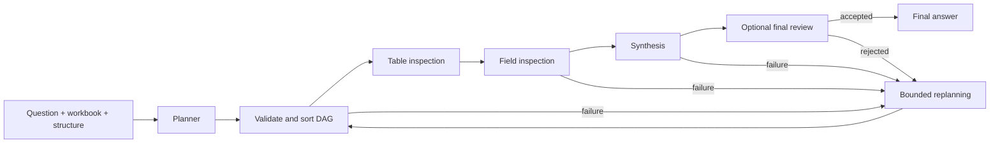

# QA Pipeline

The QA pipeline answers workbook questions through one general orchestration path. It does not select a formatter or
execution route from benchmark labels, answer types, question language, or question category.

## Inputs

`TableQARunner` receives:

- a workbook path;
- a verified `structure.yaml` path;
- a question;
- an LLM client or custom code-generation action;
- optional related sheet structures and an indexed table retriever.

The outer `TableAgentPipeline` can fall back to source text or an image prompt when `structure.yaml` is missing, empty,
or invalid. The CLI can also receive prepared ingestion artifacts with `--artifacts PATH`.

## Execution Flow


```mermaid
flowchart LR
    A[Question + workbook + structure] --> B[Planner]
    B --> C[Validate and sort DAG]
    C --> D[Table inspection]
    D --> E[Field inspection]
    E --> F[Synthesis]
    F --> G[Optional final review]
    G -->|accepted| H[Final answer]
    C -->|failure| I[Bounded replanning]
    E -->|failure| I
    F -->|failure| I
    G -->|rejected| I
    I --> C
```

The planner uses three subtask layers:

| Layer | Purpose |
| --- | --- |
| `table_inspect` | Select one or more relevant table IDs when the workbook exposes multiple tables. |
| `inspect` | Read metadata or extract, filter, join, group, and validate workbook values. |
| `synthesis` | Compute and assign the user-facing `final_answer` from accepted inspection evidence. |

Plans are JSON DAGs. Every subtask has `id`, `description`, `layer`, and `depends_on`; optional `metadata` carries table
IDs, target names, and dependency variable names. Descriptive workbook or sheet questions use the same `inspect` and
`synthesis` layers as calculation and record-lookup questions.

## Orchestration

`TableQARunner`:

1. Loads the workbook, primary structure, related sheet structures, and operator facade.
2. Requests a plan and repairs malformed planner JSON once.
3. Inserts a table-selection task when multiple tables require routing.
4. Validates duplicate IDs, missing dependencies, and dependency cycles.
5. Executes the topologically sorted plan in a persistent notebook namespace.
6. Passes accepted dependency variables to synthesis.
7. Replans after bounded planning, execution, synthesis, or final-review failures.
8. Serializes the final value and replaces unambiguous internal header IDs with verified labels.

Every non-synthesis task runs through `TableQAAgent`; every synthesis task runs through `TableQASynthesisAgent`. There is
no deterministic benchmark-specific answer route.

## Structure And Multi-Sheet Context

The primary structure provides table IDs, sheet ownership, header ranges, data ranges, descriptions, parent/child
headers, and formula relations. Related prepared structures expose sibling-sheet summaries to the planner, allowing it
to plan cross-sheet joins, unions, and grouped aggregations without placing full workbooks in the prompt.

When a requested field is a parent header, generated code can use:

- `operators.resolve_header_columns(table_id, parent_header_id)` to obtain all leaf columns;
- `operators.group_header_mask(...)` to apply `any` or `all` conditions across those children;
- the filter, selection, projection, table, workbook, and formula-relation operators for deterministic reads.

## Retrieval

Indexed QA consumes retrieval cards and embeddings produced by ingestion. Hybrid retrieval combines lexical,
embedding, entity, and metadata evidence, then returns the selected workbook, sheet, table ID, structure, and source
context. Embedding export requires a configured real provider and model; mock or missing embedding providers are
rejected when embedding is requested.

The retriever is an input-selection layer. Once a source is selected, the same general QA orchestration executes it.

## Validation And Fallback

Validation happens at several boundaries:

- planner JSON and DAG validation;
- notebook execution restrictions and captured namespace updates;
- local and optional LLM review of each subtask;
- optional independent final-answer review against runtime evidence;
- verified-observation fallback when synthesis fails but safe inspection evidence exists.

If no usable structure is supplied, `TableAgentPipeline._run_verified_qa()` does not construct a partially initialized
runner. It invokes the configured source-context fallback and records `fallback_used` and `fallback_source` in QA
metadata.

## Artifacts

Each run can persist:

- `plan.json`;
- `events.jsonl`;
- `result.json`;
- generated code by subtask;
- the answer-producing code;
- notebook cells and an exported notebook.

Artifacts include the executed plan, observations, retry/replan counts, LLM call metrics, token usage, and the final
answer. They do not contain answer-category routing fields.

## Configuration

The main QA controls are:

| Setting | Purpose |
| --- | --- |
| `qa_max_retries` | Maximum retry rounds for one subtask. |
| `qa_max_replans` | Maximum complete-plan replacements after failures. |
| `qa_final_answer_review` | Enable independent final-answer verification. |
| `qa_artifact_dir` | Directory for per-run QA artifacts. |
| `qa_log_path` | Optional event log path. |
| `qa_max_observation_chars` | Observation preview size. |
| `qa_max_error_chars` | Error preview size. |
| `qa_max_value_repr_chars` | Namespace value preview size. |

## Verification

Run the focused QA and pipeline tests with:

```bash
pytest -q tests/test_table_agent_qa.py tests/test_table_agent_pipeline.py
```

Then run the complete suite:

```bash
pytest -q
```
