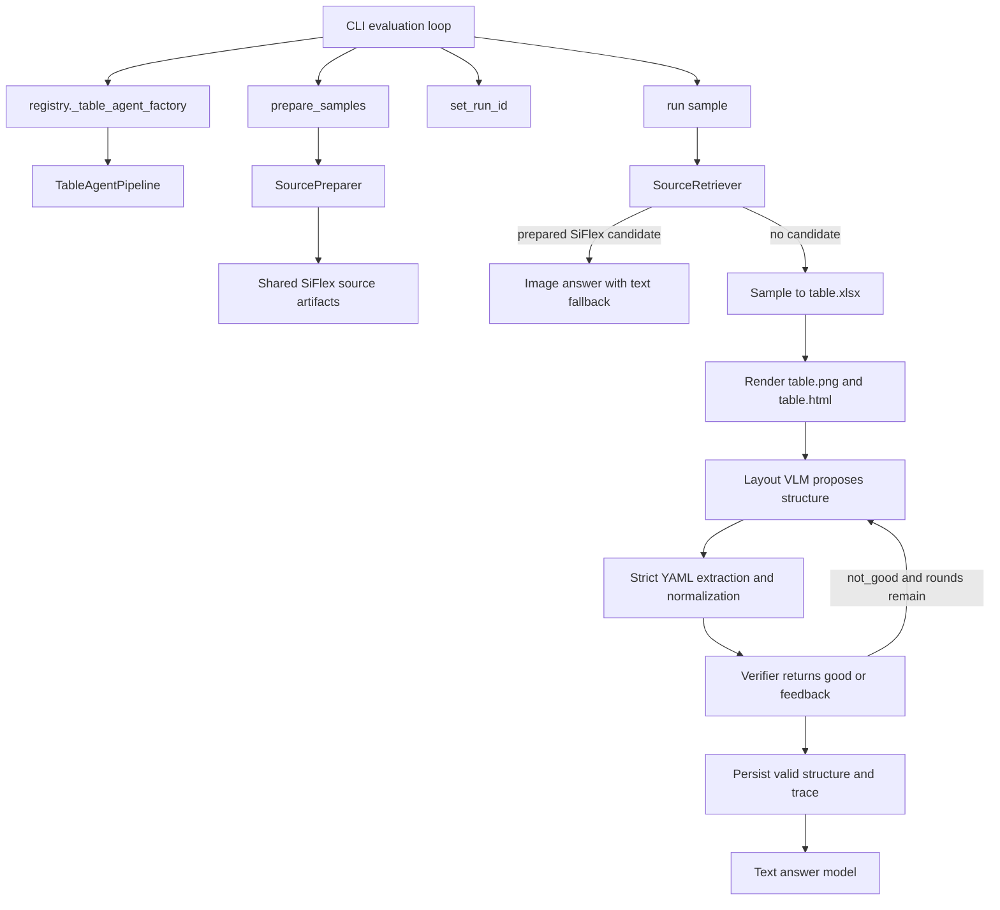

# TableAgent

TableAgent is the image-assisted table-structure and question-answering pipeline used by
the `table_agent` benchmark option. It converts table inputs into workbooks and images,
asks layout and verification agents for a grounded `structure.yaml`, and then asks the
QA agent to answer the sample question. Prepared XLSX sources use an ExStruct-backed,
multi-viewport MAS; the per-sample fallback retains the legacy single-image loop.

This document describes the current implementation under `TableAgent/`. The legacy
import path `pipelines.table_agent_pipeline` is only a compatibility shim.

## Quick start

From the repository root:

```bash
uv sync
uv run ise-table --dataset hitab --pipeline table_agent --limit 5 --repeats 1
uv run ise-table --dataset mulhi --pipeline table_agent --limit 5 --repeats 1
uv run ise-table --dataset siflex --pipeline table_agent --limit 5 --repeats 1
```

Run the focused tests with:

```bash
uv run pytest tests/test_table_agent_pipeline.py tests/test_openai_llm.py -q
```

## Architecture

```text
TableAgent/
├── config.py                       Configuration loading and run-scoped paths
├── perception/
│   └── structure.py                YAML extraction, normalization, and sanity checks
├── pipeline/
│   ├── table_agent_pipeline.py     Main orchestration and lifecycle hooks
│   ├── prompting.py                Prompt assembly and SiFlex answer formatting
│   ├── source_preparer.py          Reusable SiFlex sheet encoding
│   ├── retrieval.py                Candidate loading, lexical rank, and LLM rerank
│   └── common.py                   Shared records, paths, and token accounting
├── rendering/
│   ├── workbook.py                 Sample/source workbook-to-image flow
│   └── image_utils.py              Scaling, resizing, and optional image tiling
└── utils/
    └── table_text.py               Lexical overlap and simple Markdown conversion
```

Code outside this package still participates in the pipeline:

- [`../registry.py`](../registry.py) creates the answer LLM and layout VLM, then applies
  benchmark-run artifact scoping.
- [`../cli/__init__.py`](../cli/__init__.py) calls `set_run_id()`, `prepare_samples()`,
  and `run()` during evaluation.
- [`../prompts/table_agent.py`](../prompts/table_agent.py) contains the layout,
  verification, answer, and reranker templates.
- [`../utils/workbook_converter.py`](../utils/workbook_converter.py) normalizes benchmark
  samples into `.xlsx` workbooks.
- [`../table2img/core.py`](../table2img/core.py) converts workbooks into renderable
  documents and writes PNG/HTML artifacts.
- [`../pipelines/table_agent_pipeline.py`](../pipelines/table_agent_pipeline.py) re-exports
  public names for older callers and tests.

`pipeline/base_pipeline.py` is currently a placeholder and is not used by the benchmark
pipeline.

## Component flow



There are two execution paths because SiFlex questions can reference one or more source
workbooks with many worksheets. HiTab and MulHi normally use the standard per-sample
path.

## Standard per-sample flow

`TableAgentPipeline.run()` performs the following steps when no prepared source is
retrieved:

1. Build a stable sample artifact directory from `sample_id`, `table_id`, and question.
2. Convert the sample to `table.xlsx`.
3. Render the workbook as `table.png` and `table.html`.
4. Send the image plus bounded text context to the layout VLM.
5. Extract only the supported YAML schema and save discarded model prose as a thinking
   trace.
6. Ask the verifier for `status: good` or actionable feedback.
7. Repeat layout generation with that feedback for at most
   `max_refinement_rounds + 1` total layout attempts.
8. Persist `structure.yaml` only when it passes the local structural sanity check.
9. Ask the answer LLM using the table text and final structure.
10. Return the answer, token usage, verification result, and artifact paths in
    `PipelineOutput.metadata`.

The standard final-answer call is currently text-only. The image is used by the layout
VLM, but `run()` calls `llm.generate()` for the final answer. Treat a change to this
behavior as a deliberate pipeline change and cover it with tests.

## Prepared-source flow (SiFlex)

Before repeats begin, the CLI calls `prepare_samples()`:

1. Collect unique `.xlsx` files and run ExStruct once per workbook.
2. Write each sheet's non-commented metadata contract to `metadata.yaml`.
3. Start at the top-left cell of the first table candidate (or used range fallback).
4. Render a coordinate-labelled cell viewport, defaulting to 20 rows by 20 columns.
5. Ask LayoutAgent to update `structure.yaml`, emit a changelog, and suggest directions.
6. Have VerificationAgent write and execute `verification.py`, then review its report.
7. Traverse `stay`, `right`, `down`, `left`, and `up` through a priority queue. Cardinal
   shifts default to 15 cells. A direction receives one extra attempt after its first
   verified zero-change viewport and stops after the second.
8. Retry a failed viewport with `stay` up to `max_retry`; after exhaustion, set
   unverifiable ranges to `null`.
9. Stop when the queue is empty and leave the reusable source for QAAgent retrieval.

Each loop directory contains its image/HTML, prompts, raw responses, before/after
structures, changelog, generated verifier, verifier output, and discarded layout prose.
`events.jsonl` is the compact traversal index.

At question time, `SourceRetriever`:

1. Restricts candidates to workbooks listed in `sample.table_path`.
2. Rejects missing or locally invalid structures.
3. Ranks candidates by lexical overlap with flattened sheet text.
4. Optionally asks the LLM to rerank the top `retrieval_top_k` candidates.
5. Falls back to the lexical best candidate if reranker output is invalid.
6. Answers with the selected sheet image when the answer client supports
   `generate_with_image()`; otherwise it uses the sheet-text fallback prompt.

## `structure.yaml` contract

Prepared XLSX sources use table keys (the legacy fallback still accepts `headers`):

```yaml
table1:
  name: Revenue
  description: Annual company revenue
  headers:
    - label: Year
      description: Fiscal year labels
      orientation: column
      header_range: A1:A1
      data_range: A2:A12
      sub_headers: []
```

Required semantics:

- `label` is a meaningful label observed or safely inferred from the table. Do not use
  placeholders such as `Header`, `Column 1`, or `UNKNOWN`.
- `description` explains the specific semantic role of the header.
- `orientation` is `row`, `column`, or `mixed`.
- `header_range` and `data_range` are exact A1-style references supported by the viewport.
- Use `null` when exact coordinates cannot be determined. Never guess.
- `sub_headers` is always a list for top-level headers and may be empty.
- Sub-headers use the same range fields; deeper nesting is not part of the current schema.

`extract_strict_structure()` accepts fenced or unfenced YAML, removes unsupported keys,
normalizes fields, and separates discarded prose from persisted YAML. Uncertainty
sentinels such as `UNKNOWN`, `uncertain`, and `N/A` are normalized to `null` ranges.

The verifier must return:

```yaml
status: good
feedback: Structure is supported by the table.
null_fields: []
```

or:

```yaml
status: not_good
feedback: Correct the 2024 header range from B1 to B2.
null_fields: [table1.headers[0].header_range]
```

A `null` range is valid and must not be the sole reason for rejection. A missing range
key and an invalid or unsupported A1 reference should be rejected.

### Important validation boundary

`_is_valid_structure()` remains a local sanity check. The generated `verification.py`
adds deterministic A1 syntax and Excel-bound checks, while VerificationAgent judges
visible header semantics and data-range correctness. Neither layer should silently
broaden an invalid range.

## Prompt templates

Prompt constants live in [`../prompts/table_agent.py`](../prompts/table_agent.py), while
`pipeline/prompting.py` binds sample data to those templates.

| Template | Model | Purpose |
| --- | --- | --- |
| `LAYOUT_*` | Layout VLM | Produce strict header hierarchy and A1/null ranges |
| `VERIFICATION_*` | Answer LLM | Return `good` or corrective feedback |
| `ANSWER_*` | Answer LLM | Produce only the final benchmark answer |
| `RERANKER_*` | Answer LLM | Select a prepared SiFlex worksheet |

When changing a prompt:

1. Keep the parser contract and prompt schema synchronized.
2. Add a focused assertion in `tests/test_table_agent_pipeline.py`.
3. Test fenced YAML, prose around YAML, malformed output, and `null` ranges as relevant.
4. Inspect `thinking_trace.txt` after a real run for runaway reasoning.
5. Compare both accuracy and token usage; prompt changes can alter refinement count.

## Configuration

Defaults are defined in [`../configs/pipelines.yaml`](../configs/pipelines.yaml) and
overridden by the root [`../config.yaml`](../config.yaml). `TableAgentConfig.from_config()`
deep-merges explicit construction overrides over the loaded root configuration. The CLI
then injects run-scoped artifact directories with `run_scoped_table_agent_config()`.

Key settings:

| Setting | Meaning |
| --- | --- |
| `artifact_root` | Root for benchmark-run artifacts |
| `evaluation_output_dir` | Reports, scores, and summaries |
| `log_dir` | Run and worker logs |
| `run_dir_template` | Directory template containing `{run_name}` |
| `repeat_dir_template` | Per-repeat template containing `{run_id}` |
| `shared_dir_name` | Reusable prepared-source directory name |
| `artifact_dir` | Fallback for direct/manual pipeline construction |
| `max_refinement_rounds` | Corrective rounds after the initial layout attempt |
| `max_context_chars` | Maximum text context before truncation |
| `render_backend` | Renderer backend passed to `table2img` |
| `image_scale` | Initial image render scale |
| `max_image_dimension` | Maximum width or height after scaling |
| `max_image_pixels` | Maximum total image pixels |
| `image_tile_size` | Optional tile edge length; `null` disables tiling |
| `image_tile_overlap` | Overlap between adjacent tiles |
| `generation_max_tokens` | Optional pipeline-wide client cap; `null` leaves it unset |
| `retrieval_rerank_with_llm` | Enable SiFlex LLM reranking |
| `retrieval_top_k` | Maximum candidates sent to the reranker |
| `retrieval_candidate_max_chars` | Text preview budget per candidate |
| `exstruct_mode` | ExStruct extraction mode for source preparation |
| `viewport_rows` / `viewport_columns` | Viewport dimensions in cells (default 20×20) |
| `shift_cells` | Cardinal movement distance in cells (default 15) |
| `max_retry` | Maximum `stay` attempts before ranges become `null` (default 5) |

The active answer and layout providers are selected by top-level `llm.provider` and
`vlm.provider`. Their model blocks may also define `max_tokens`. To leave generation
uncapped by the client, both provider-level `max_tokens` and
`table_agent.generation_max_tokens` must be `null`. The model server still enforces its
own context and output limits.

## Artifact layout

Prepared source directories contain `metadata.yaml`, `structure.yaml`, `changelog.md`,
`events.jsonl`, and `iterations/`. Each iteration directory is named with its sequence,
direction, and A1 viewport and contains `viewport.png`, `viewport.html`, layout and
verification prompts/responses, before/after structures, `verification.py`, and
`verification_output.json`.

Benchmark CLI runs use this structure:

```text
TableAgent/outputs/
├── artifacts/<dataset>-table_agent-<timestamp>/
│   ├── shared/sources/
│   │   └── <workbook>_<sheet>/
│   │       ├── table.png
│   │       ├── table.html
│   │       ├── sheet_text.txt
│   │       ├── metadata.json
│   │       ├── structure.yaml       # success
│   │       ├── structure.error      # failure; mutually exclusive with YAML
│   │       └── thinking_trace.txt   # present only when prose was discarded
│   └── repeat_<n>/<sample_id>/<hash>/
│       ├── table.xlsx
│       ├── table.png
│       ├── table.html
│       ├── structure.yaml           # present only when locally valid
│       ├── thinking_trace.txt       # optional
│       ├── metadata.json            # optional image-tile metadata
│       └── table_tile_*.png         # only when tiling is enabled
├── evaluations/<dataset>-table_agent-<timestamp>/
│   ├── report_<n>.json
│   ├── report_<n>.csv
│   ├── scores.csv
│   └── summary.json
└── logs/<dataset>-table_agent-<timestamp>/
```

Artifact directories are isolated by repeat so a later repeat cannot silently reuse or
overwrite a per-sample structure from an earlier repeat. Prepared SiFlex source artifacts
are shared because they are intentionally reusable across repeat runs.

## Public API and lifecycle hooks

Preferred imports:

```python
from TableAgent import TableAgentConfig, TableAgentPipeline
```

The pipeline implements these benchmark-facing methods:

- `prepare_samples(samples, logger=None)`: pre-encode SiFlex source worksheets.
- `set_run_id(run_id)`: select the active repeat artifact directory.
- `run(sample)`: process one `EvalSample` and return `PipelineOutput`.
- `get_config()`: capture effective clients, settings, active paths, and prompts for run
  reports.

The layout client must implement `generate_with_image()`. The answer client must
implement `generate()` and may optionally implement `generate_with_image()` for prepared
source answering.

## Extending TableAgent

Keep changes surgical and place them at the narrowest ownership boundary:

- Add or change orchestration in `pipeline/table_agent_pipeline.py`.
- Change prompt wording or answer formats in `prompts/table_agent.py` and
  `pipeline/prompting.py`.
- Add YAML schema or grounding rules in `perception/structure.py`.
- Change source indexing or candidate scoring in `pipeline/retrieval.py`.
- Change SiFlex preprocessing and cache behavior in `pipeline/source_preparer.py`.
- Change workbook/image behavior in `rendering/`.
- Add settings to `TableAgentConfig`, `configs/pipelines.yaml`, and the root override as
  needed; document the precedence.

For behavior changes, test the observable contract rather than private implementation
details. Useful existing coverage includes:

- verified and invalid structure persistence;
- strict schema extraction and discarded reasoning;
- `null` and uncertainty range behavior;
- source preparation and `structure.error` caching;
- retrieval fallback and LLM reranking;
- repeat artifact isolation;
- image scaling and tiling; and
- explicit and unset token caps.

## Debugging checklist

When a run produces a wrong answer or structure:

1. Open `table.png` or `table.html` and confirm the displayed coordinates.
2. Compare every YAML range against those coordinates; distinguish global combined-sheet
   coordinates from table-local row numbers.
3. Check `thinking_trace.txt` for reasoning that consumed the response before YAML was
   emitted.
4. Inspect report metadata for verifier status and feedback.
5. Inspect worker logs for connection errors, retries, and whether each call was text or
   vision.
6. For SiFlex, inspect `retrieval_info`, candidate sheet names, lexical score, reranker
   index, and fallback flag.
7. Check whether the answer double-counted subtotal or total rows.
8. Check evaluator conventions such as decimal-versus-percent formatting.

Common failure classes include valid-looking but shifted A1 ranges, table-local ranges in
a combined workbook, verifier false positives, missing YAML after runaway reasoning,
model-server disconnections, and exact-match formatting disagreements.

## Development principles

- Preserve `range: null` as the uncertainty representation; do not invent coordinates.
- Keep persisted YAML schema-only. Model reasoning belongs in logs or
  `thinking_trace.txt`.
- Do not treat local YAML validity as proof of workbook grounding.
- Keep standard and prepared-source behavior explicit; changes to one path should not
  silently affect the other.
- Keep artifacts reproducible and repeat-scoped.
- Add a regression test for every bug before or alongside its fix.
