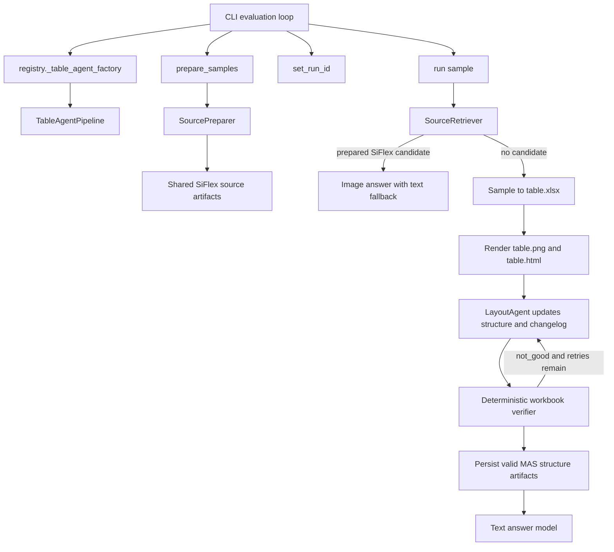

# TableAgent

TableAgent is the image-assisted table-structure and question-answering pipeline used by
the `table_agent` benchmark option. It converts table inputs into workbooks and images,
asks the layout VLM for a candidate `structure.yaml`, verifies it with deterministic
workbook-backed code, and then runs QA against the persisted structure cache.

This document describes the current implementation under `TableAgent/`. The legacy
import path `pipelines.table_agent_pipeline` is only a compatibility shim.

## Quick start

From the repository root:

```bash
uv sync
uv run ise-table --dataset hitab --pipeline table_agent --limit 5 --repeats 1
uv run ise-table --dataset mulhi --pipeline table_agent --limit 5 --repeats 1
uv run ise-table --dataset siflex --pipeline table_agent --limit 5 --repeats 1
```

TableAgent exposes three phases:

```bash
uv run ise-table --dataset hitab --pipeline table_agent --table-agent-phase structure --limit 5
uv run ise-table --dataset hitab --pipeline table_agent --table-agent-phase qa --limit 5
uv run ise-table --dataset hitab --pipeline table_agent --table-agent-phase all --limit 5
```

`structure` builds caches without an answer LLM, `qa` reuses valid caches without a
layout VLM, and `all` forces structure generation before QA.

Run the focused tests with:

```bash
uv run pytest table2img/tests/test_core.py tests/test_table_agent_mas.py tests/test_table_agent_pipeline.py -q
```

## Architecture

```text
TableAgent/
|-- agents/base.py                   Shared lightweight agent message and memory types
|-- configs/table_agent.py           Configuration loading and run-scoped paths
|-- prompts/                          Prompt modules split by model/task type
|-- structure/
|   |-- layout/
|   |   |-- agent.py                 Sends coordinate-labelled images to the layout VLM
|   |   |-- parsing.py               YAML extraction, normalization, and sanity checks
|   |   `-- workflow.py              Structure traversal and refinement orchestration
|   `-- verification/                Deterministic workbook-backed verification
|-- pipeline/
|   |-- table_agent_pipeline.py      Main orchestration and lifecycle hooks
|   |-- prompting.py                 Prompt binding and SiFlex answer formatting
|   |-- source_preparer.py           Reusable SiFlex sheet encoding
|   |-- retrieval/                   Candidate loading, ranking, and reranking
|   `-- common.py                    Shared records, paths, and token accounting
|-- rendering/                       Workbook-to-image rendering and image utilities
`-- utils/table_text.py              Lexical overlap and Markdown conversion
```

Code outside this package still participates in the pipeline:

- [`../registry.py`](../registry.py) creates the answer LLM and layout VLM, then applies
  benchmark-run artifact scoping.
- [`../cli/__init__.py`](../cli/__init__.py) calls `set_run_id()`, `prepare_samples()`,
  and `run()` during evaluation.
- [`prompts/`](prompts/) contains separate modules for structure, answer, reranker,
  planner, ReAct, review, and synthesis prompts.
- [`../utils/workbook_converter.py`](../utils/workbook_converter.py) normalizes benchmark
  samples into `.xlsx` workbooks.
- [`../table2img/core.py`](../table2img/core.py) converts workbooks into renderable
  documents and writes PNG/HTML artifacts.
- [`../pipelines/table_agent_pipeline.py`](../pipelines/table_agent_pipeline.py) re-exports
  public names for older callers and tests.

`pipeline/base_pipeline.py` is currently a placeholder and is not used by the benchmark
pipeline.

## Component flow



SiFlex questions can reference one or more source workbooks with many worksheets, so
they pre-encode reusable source artifacts. HiTab and MulHi normally create a transient
workbook per sample, then run the same MAS workflow on that workbook.

## Multi-table QA operators

The QA notebook exposes a `multitab` operator family through the existing `operators`
facade:

- `operators.find_tables(...)` routes a question or subtask through an injected table
  retriever when available, with the built-in lexical metadata scorer as a fallback.
- `operators.join_tables(...)`, `operators.union_tables(...)`, and
  `operators.groupby(...)` provide deterministic relational operations.
- `operators.find_relation(...)` and `operators.evaluate_formula(...)` use formula
  relations embedded in `structure.yaml`. Formula evaluation applies mutations only in
  memory and recursively recalculates referenced formula cells without changing the
  workbook.

For example, to recalculate `E13 = C13 * D13` after increasing `C13`:

```python
result = operators.evaluate_formula(
    "rel_salary_calc",
    target_cell="E13",
    mutations={"C13": 18_000_000 + 2_000_000},
)
final_answer = result["value"]
```

## Standard per-sample flow

`TableAgentPipeline.run()` performs the following steps when no prepared source is
retrieved:

1. Build a stable sample artifact directory from `sample_id`, `table_id`, and question.
2. Convert the sample to `table.xlsx`.
3. Derive lightweight sheet metadata from the workbook.
4. Render coordinate-labelled viewports, copying the first viewport to `table.png` and
   `table.html`. Edge viewports are clipped to `used_range`, so a small sheet does not
   produce rows or columns of blank cells merely to fill the configured viewport.
5. Ask LayoutAgent to update the structure, emit a changelog, and suggest directions.
6. Run deterministic range checks and feed concrete failures back to LayoutAgent.
7. Traverse and retry viewports using the same MAS queue used by prepared sources.
8. Persist `structure.yaml` only when it passes the local structural sanity check.
9. Ask the answer LLM using the table text and final structure.
10. Return the answer, token usage, verification result, and artifact paths in
    `PipelineOutput.metadata`.

The standard final-answer call is currently text-only. The image is used by the layout
VLM, but `run()` calls `llm.generate()` for the final answer. Treat a change to this
behavior as a deliberate pipeline change and cover it with tests.

## Prepared-source flow (SiFlex)

Before repeats begin, the CLI calls `prepare_samples()`:

1. Collect unique `.xlsx` files and run ExStruct once per workbook.
2. Write each sheet's non-commented metadata contract to `metadata.yaml`. If ExStruct
   omits merged ranges, TableAgent falls back to openpyxl merged-cell geometry and
   expands the used range to include those merged spans.
3. Start at the top-left cell of the first table candidate (or used range fallback).
4. Render a coordinate-labelled cell viewport, defaulting to 50 rows by 50 columns and
   clipping the captured range at the sheet's `used_range`.
5. Ask LayoutAgent to update `structure.yaml`, emit a changelog, and suggest directions.
6. Invoke `python -m TableAgent.structure.verification.worker` and persist its JSON report.
7. Traverse `stay`, `right`, `down`, `left`, and `up` through a priority queue. Cardinal
   shifts default to 45 cells. A direction receives one extra attempt after its first
   verified zero-change viewport and stops after the second.
8. Retry a failed viewport with `stay` up to `max_retry`; after exhaustion, set
   unverifiable ranges to `null`.
9. Stop when the queue is empty and leave the reusable source for QAAgent retrieval.

Each loop directory contains its image/HTML, layout prompt/response, before/after
structures, changelog, deterministic verifier output, and discarded layout prose.
`events.jsonl` is the compact traversal index.

### Deterministic verification

The verifier checks A1 syntax, worksheet bounds, visible header text, merged-cell
expansion, data/header overlap, parent/child containment, and repairs that can be proved
from workbook contents. It runs in a UTF-8 subprocess with timeout and invalid-output
handling. Failed reports feed precise feedback back to LayoutAgent; after `max_retry`,
only reported `null_fields` are set to `null`. There is no semantic verification LLM.

At question time, `SourceRetriever`:

1. Restricts candidates to workbooks listed in `sample.table_path`.
2. Rejects missing or locally invalid structures.
3. Ranks candidates by lexical overlap with flattened sheet text.
4. Optionally asks the LLM to rerank the top `retrieval_top_k` candidates.
5. Falls back to the lexical best candidate if reranker output is invalid.
6. Answers with the selected sheet image when the answer client supports
   `generate_with_image()`; otherwise it uses the sheet-text fallback prompt.

## `structure.yaml` contract

MAS structure extraction persists table keys:

```yaml
table1:
  name: Revenue
  description: Annual company revenue
  headers:
    - label: Year
      description: Fiscal year labels
      orientation: column
      header_range: A1:A1
      data_range: A2:A12
      sub_headers: []
```

Required semantics:

- `label` is a meaningful label observed or safely inferred from the table. Do not use
  placeholders such as `Header`, `Column 1`, or `UNKNOWN`.
- `description` explains the specific semantic role of the header.
- `orientation` is `row` or `column`.
- `header_range` and `data_range` are exact A1-style references supported by the viewport.
- Use `null` when exact coordinates cannot be determined. Never guess.
- `sub_headers` is always a list for top-level headers and may be empty.
- Sub-headers use the same range fields; deeper nesting is not part of the current schema.

`extract_layout_structure()` parses the MAS envelope, removes control keys from
persisted YAML, and normalizes uncertainty sentinels such as `UNKNOWN`, `uncertain`,
and `N/A` to `null` ranges. `extract_strict_structure()` remains available from the
compatibility shim for older callers of the legacy `headers` utility surface, but it is
not used by active structure extraction.

The verifier must return:

```yaml
thought: deterministic ranges align with the visible header.
action: accept
observation: no repair is needed.
status: good
feedback: Structure is supported by the table.
null_fields: []
```

or:

```yaml
thought: the data range overlaps a child header.
action: repair_structure
observation: the corrected range starts below the child header.
status: not_good
feedback: Correct the 2024 header range from B1 to B2.
null_fields: [table1.headers[0].header_range]
updated_structure:
  table1:
    name: Revenue
    description: Annual company revenue
    headers:
      - label: Year
        description: Fiscal year labels
        orientation: column
        header_range: A1:A1
        data_range: A2:A12
        sub_headers: []
```

A `null` range is valid and must not be the sole reason for rejection. A missing range
key and an invalid or unsupported A1 reference should be rejected.

### Important validation boundary

`_is_valid_structure()` remains a local sanity check. The deterministic verifier adds
A1 syntax, Excel-bound, visible-text, merged-cell, and data-range checks and may apply
only repairs proved from workbook contents.

## Prompt templates

Prompt constants live in task-specific modules under [`prompts/`](prompts/), while
`pipeline/prompting.py` binds sample data to those templates.

| Template | Model | Purpose |
| --- | --- | --- |
| `LAYOUT_MAS_*` | Layout VLM | Update MAS structure, changelog, and traversal directions |
| `ANSWER_*` | Answer LLM | Produce only the final benchmark answer |
| `RERANKER_*` | Answer LLM | Select a prepared SiFlex worksheet |

When changing a prompt:

1. Keep the parser contract and prompt schema synchronized.
2. Add a focused assertion in `tests/test_table_agent_mas.py` or `tests/test_table_agent_pipeline.py`.
3. Test fenced YAML, prose around YAML, malformed output, and `null` ranges as relevant.
4. Inspect `iterations/*/layout_discarded.txt` after a real run for runaway reasoning.
5. Compare both accuracy and token usage; prompt changes can alter refinement count.

## Configuration

All dataset, pipeline, and model settings live in the root
[`../config.yaml`](../config.yaml). YAML includes are not supported. The CLI loads the
file once, passes the resolved `table_agent` section into `TableAgentConfig`, and then
injects run-scoped QA artifact directories.

Key settings:

| Setting | Meaning |
| --- | --- |
| `artifact_root` | Root for benchmark-run artifacts |
| `evaluation_output_dir` | Reports, scores, and summaries |
| `log_dir` | Run and worker logs |
| `run_dir_template` | Directory template containing `{run_name}` |
| `repeat_dir_template` | Per-repeat template containing `{run_id}` |
| `shared_dir_name` | Reusable prepared-source directory name |
| `artifact_dir` | Fallback for direct/manual pipeline construction |
| `phase` | `structure`, `qa`, or `all` |
| `structure_cache_dir` | Persistent content-addressed structure cache root |
| `max_refinement_rounds` | Corrective rounds after the initial layout attempt |
| `max_context_chars` | Maximum text context before truncation |
| `render_backend` | Renderer backend passed to `table2img` |
| `image_scale` | Initial image render scale |
| `max_image_dimension` | Maximum width or height after scaling |
| `max_image_pixels` | Maximum total image pixels |
| `image_tile_size` | Optional tile edge length; `null` disables tiling |
| `image_tile_overlap` | Overlap between adjacent tiles |
| `generation_max_tokens` | Optional pipeline-wide client cap; `null` leaves it unset |
| `retrieval_rerank_with_llm` | Enable SiFlex LLM reranking |
| `retrieval_top_k` | Maximum candidates sent to the reranker |
| `retrieval_candidate_max_chars` | Text preview budget per candidate |
| `exstruct_mode` | ExStruct extraction mode for source preparation |
| `viewport_rows` / `viewport_columns` | Viewport dimensions in cells (default 50×50) |
| `shift_cells` | Cardinal movement distance in cells (default 45) |
| `max_retry` | Maximum `stay` attempts before ranges become `null` (default 5) |

### Workbook image fidelity

XLSX rendering preserves merged cells, solid fills, font color/weight/style/size,
horizontal and vertical alignment, explicit column widths, and explicit row heights.
This metadata is honored by both the configured Pillow backend and the browser backend.
If a viewport cuts through a merged cell, its visible fragment retains the anchor value
and style.

All cell text is kept as UTF-8 in the generated HTML. Pillow selects fonts per character,
detects missing glyphs without requiring `fontTools`, and searches installed system fonts
when the preferred multilingual stack does not cover a script. The host still needs at
least one font containing each requested script; on minimal Linux images, install the
relevant Noto font families (for example, Noto Sans CJK).

Prepared-source metadata cache entries use `layout_workflow_version: 4`; older source
artifacts are regenerated so stale rendering or merged-range metadata is not silently
reused.

The active answer and layout providers are selected by top-level `llm.provider` and
`vlm.provider`. Their model blocks may also define `max_tokens`. To leave generation
uncapped by the client, both provider-level `max_tokens` and
`table_agent.generation_max_tokens` must be `null`. The model server still enforces its
own context and output limits.

## Artifact layout

Prepared source directories contain `metadata.yaml`, `structure.yaml`, `changelog.md`,
`events.jsonl`, and `iterations/`. Each iteration directory is named with its sequence,
direction, and A1 viewport and contains `viewport.png`, `viewport.html`, layout and
verification prompts/responses, before/after structures, `verification.py`, and
`verification_output.json`. The verifier implementation lives in the package and is not
copied into each iteration directory.

Benchmark CLI runs use this structure:

```text
TableAgent/outputs/
├── artifacts/<dataset>-table_agent-<timestamp>/
│   ├── shared/sources/
│   │   └── <workbook>_<sheet>/
│   │       ├── table.png
│   │       ├── table.html
│   │       ├── sheet_text.txt
│   │       ├── metadata.json
│   │       ├── structure.yaml       # success
│   │       ├── structure.error      # failure; mutually exclusive with YAML
│   │       ├── changelog.md
│   │       ├── events.jsonl
│   │       └── iterations/
│   └── repeat_<n>/<sample_id>/<hash>/
│       ├── table.xlsx
│       ├── table.png
│       ├── table.html
│       ├── structure.yaml           # present only when locally valid
│       ├── metadata.yaml
│       ├── changelog.md
│       ├── events.jsonl
│       ├── iterations/
│       ├── metadata.json            # optional image-tile metadata
│       └── table_tile_*.png         # only when tiling is enabled
├── evaluations/<dataset>-table_agent-<timestamp>/
│   ├── report_<n>.json
│   ├── report_<n>.csv
│   ├── scores.csv
│   └── summary.json
└── logs/<dataset>-table_agent-<timestamp>/
```

Artifact directories are isolated by repeat so a later repeat cannot silently reuse or
overwrite a per-sample structure from an earlier repeat. Prepared SiFlex source artifacts
are shared because they are intentionally reusable across repeat runs.

## Public API and lifecycle hooks

Preferred imports:

```python
from TableAgent import TableAgentConfig, TableAgentPipeline
```

The pipeline implements these benchmark-facing methods:

- `prepare_samples(samples, logger=None)`: pre-encode SiFlex source worksheets.
- `set_run_id(run_id)`: select the active repeat artifact directory.
- `run(sample)`: process one `EvalSample` and return `PipelineOutput`.
- `get_config()`: capture effective clients, settings, active paths, and prompts for run
  reports.

The layout client must implement `generate_with_image()`. The answer client must
implement `generate()` and may optionally implement `generate_with_image()` for prepared
source answering.

## Extending TableAgent

Keep changes surgical and place them at the narrowest ownership boundary:

- Add or change orchestration in `pipeline/table_agent_pipeline.py`.
- Change prompt wording or answer formats in the matching `prompts/` module and
  `pipeline/prompting.py`.
- Add YAML schema or grounding rules in `structure/layout/parsing.py`.
- Change source indexing or candidate scoring in `pipeline/retrieval.py`.
- Change SiFlex preprocessing and cache behavior in `pipeline/source_preparer.py`.
- Change workbook/image behavior in `rendering/`.
- Add pipeline settings to `TableAgentConfig` and the root `config.yaml`.

For behavior changes, test the observable contract rather than private implementation
details. Useful existing coverage includes:

- verified and invalid structure persistence;
- strict schema extraction and discarded reasoning;
- `null` and uncertainty range behavior;
- source preparation and `structure.error` caching;
- retrieval fallback and LLM reranking;
- repeat artifact isolation;
- image scaling and tiling; and
- explicit and unset token caps.

## Debugging checklist

When a run produces a wrong answer or structure:

1. Open `table.png` or `table.html` and confirm the displayed coordinates.
2. Compare every YAML range against those coordinates; distinguish global combined-sheet
   coordinates from table-local row numbers.
3. Check `iterations/*/layout_discarded.txt` for prose that was discarded before YAML
   was persisted.
4. Inspect report metadata for verifier status and feedback.
5. Inspect `verification_output.json` for deterministic errors, repairs, and null fields.
6. Inspect worker logs for connection errors, retries, and whether each call was text or
   vision.
7. For SiFlex, inspect `retrieval_info`, candidate sheet names, lexical score, reranker
   index, and fallback flag.
8. Check whether the answer double-counted subtotal or total rows.
9. Check evaluator conventions such as decimal-versus-percent formatting.

Common failure classes include valid-looking but shifted A1 ranges, table-local ranges in
a combined workbook, verifier false positives, missing YAML after runaway reasoning,
model-server disconnections, and exact-match formatting disagreements.

## Current Flow Boundaries

The implemented MAS loop matches the high-level diagram of metadata extraction,
viewport rendering, LayoutAgent updates, deterministic verification, retry, directional
traversal, and final structure output. A few boundaries are explicit in code:

- Direction traversal expands only after a viewport verifies as `good`. A failing
  viewport retries with `stay`; it does not enqueue right/down/left/up until accepted.
- `remaining_directions` from LayoutAgent is advisory and bounded by the sheet
  `used_range`. If no valid direction is suggested, the workflow falls back to all
  valid frontier directions.
- A direction with a verified zero-change viewport gets one extra shift in the same
  direction. If the next verified viewport also has no change, that direction stops.
- There is no persistent experience pool yet. Agents have in-process message memory and
  the run leaves artifacts for humans or future tooling, but no retrieval-backed memory
  is injected into prompts.

## Development principles

- Preserve `range: null` as the uncertainty representation; do not invent coordinates.
- Keep persisted YAML schema-only. Model reasoning belongs in logs or
  `iterations/*/layout_discarded.txt`.
- Do not treat local YAML validity as proof of workbook grounding.
- Keep standard and prepared-source behavior explicit; changes to one path should not
  silently affect the other.
- Keep artifacts reproducible and repeat-scoped.
- Add a regression test for every bug before or alongside its fix.
